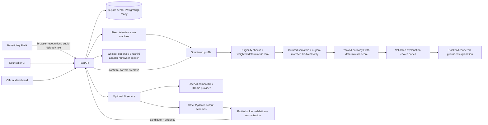

# Architecture

The browser application is Next.js/React. FastAPI owns session state, validation, SQLite persistence, pathway matching, follow-ups and aggregate views. SQLAlchemy models use portable column types and can target PostgreSQL by changing `DATABASE_URL`.

## Implemented workflow

Consent → fixed interview slots → profile confirmation → recommendations → pathway selection → action plan → follow-up. Counsellor handoff and dashboard aggregates are database-backed. Dashboard refresh uses 15-second polling. Session ids are random UUIDs and act as pseudonymous ids in this prototype.

## State and facts

Question order and allowed slots are defined in `backend/app/dialogue.py`. Recommendation ordering is deterministic and weighted. Unknown eligibility remains “needs counsellor verification”; the demo never invents course duration, fees, batch dates, openings or government links.

## Deployment shape

`docker compose up --build` runs Alembic migrations, seeds only synthetic catalogue data and demo staff accounts, and starts both services. `DATABASE_URL` can be replaced with a PostgreSQL SQLAlchemy URL; migrations must run before the API. Counsellor and admin APIs require role-limited signed HTTP-only cookies. Staff passwords are salted PBKDF2 hashes in the user table. Production requires a strong signing secret, secure cookies over HTTPS and `AUTO_CREATE_SCHEMA=false`; create named staff accounts with the management CLI. Beneficiary session URLs remain high-entropy bearer capabilities and need a dedicated beneficiary identity/access model for production.

The optional AI service is described in `backend/app/ai`. It has a provider-neutral `LLMClient`, OpenAI-compatible transport (including compatible local Ollama servers), strict structured schemas, safe-failure errors and privacy-limited logs. The regular interview message endpoint validates and normalizes candidate profile fields before updating the existing session profile. `profile_evidence` links each canonical value to its source answer and stores only the model's bounded uncertainty estimate and review status. Beneficiaries can confirm, correct or remove extracted details. Recommendations retain the existing 30/25/20/15/10 deterministic weights; semantic similarity improves skill equivalence and breaks only ties after the existing score and overlap keys. It never adds to the deterministic score. AI selects bounded explanation codes from validated recommendation data, and the backend renders the user-facing wording from catalogue/profile facts. AI remains disabled by default. RAG and broader agent tools are deferred; no model can run SQL or write database records directly.
