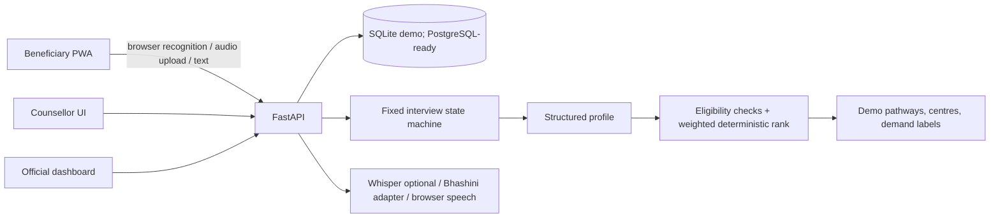

# Architecture

The browser application is Next.js/React. FastAPI owns session state, validation, SQLite persistence, pathway matching, follow-ups and aggregate views. SQLAlchemy models use portable column types and can target PostgreSQL by changing `DATABASE_URL`.

## Implemented workflow

Consent → fixed interview slots → profile confirmation → recommendations → pathway selection → action plan → follow-up. Counsellor handoff and dashboard aggregates are database-backed. Dashboard refresh uses 15-second polling. Session ids are random UUIDs and act as pseudonymous ids in this prototype.

## State and facts

Question order and allowed slots are defined in `backend/app/dialogue.py`. Recommendation ordering is deterministic and weighted. Unknown eligibility remains “needs counsellor verification”; the demo never invents course duration, fees, batch dates, openings or government links.

## Deployment shape

`docker compose up --build` starts both services. `DATABASE_URL` can be replaced with a PostgreSQL SQLAlchemy URL. Configure frontend API origin and CORS allow-list together. Hosted deployments need real authentication, TLS, secrets management, backup/retention policy, and reviewed data sources.
